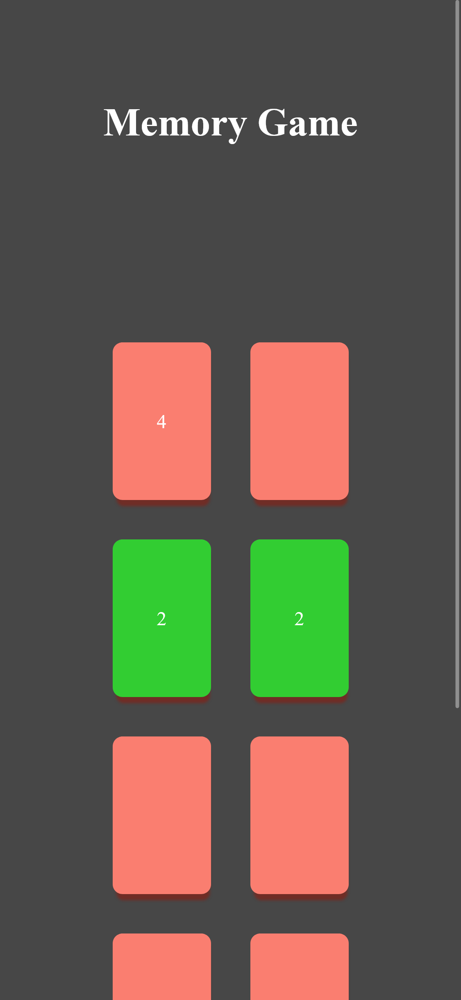
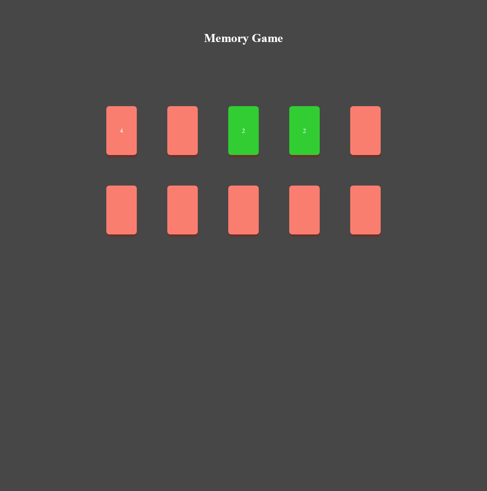

# Simple Memory Game

 - Solution URL: [GitHub](https://github.com/Sengsith/memory-game)
- Live Site URL: [Netlify](https://creative-gumdrop-129c65.netlify.app)

This was mainly created to test out my javascript and logical skills. The UI itself will be fairly bland on purpose just to focus on the desired areas of interest. The main challenge for myself was figuring out how the intereaction between the cards would be when the user clicks on the second card and transitions to clicking the third card. My main solution for this was:

Having a global count variable and array to keep track of which cards were already clicked: 
```js
const cards = [
  { value: 1, 
    id: 1
  },
  { value: 1, 
    id: 2
  },
  { value: 2, 
    id: 3
  },
  { value: 2, 
    id: 4
  },
  { value: 3, 
    id: 5
  },
  { value: 3, 
    id: 6
  },
  { value: 4, 
    id: 7
  },
  { value: 4, 
    id: 8
  },
  { value: 5, 
    id: 9
  },
  { value: 5, 
    id: 10
  },
];
let count = 0;
```

Then run a check and with each respective function: 

```js
if (count == 2) { 
  checkMatchedCards();
}
if (count >= 3) {
  handleMismatchedCards();
```

checkMatchedCards will make the matching cards green and unselectable to the user. handleMismatchedCards will flip the cards back over when the 2 cards are a mismatch and a third card is flipped over.

```js
// Run when 2 cards are displayed
function checkMatchedCards() {
  // Disable pointer events and changed background color
  if (flippedCards[0].value === flippedCards[1].value) {
    for (let i = 0; i < 2; i++) {
      document.getElementById('card-inner' + flippedCards[i].id).parentNode.style.pointerEvents = "none";
      document.getElementById('card-inner' + flippedCards[i].id).parentNode.style.backgroundColor = "limegreen";
    }
    count = 0;
    while (flippedCards.length != 0) {
      flippedCards.shift();
    }
  }
}

// Run when 2 cards are displayed AND third card is clicked
function handleMismatchedCards() {
  // Hide the 2 cards clicked, keep third card displayed
  for (let i = 0; i < 2; i++) {
    document.getElementById('card-inner' + flippedCards[i].id).style.display = "none";
    document.getElementById('card-inner' + flippedCards[i].id).parentNode.style.pointerEvents = "auto";
  }
  // Empty out first 2 cards clicked but, keep third card
  while (flippedCards.length > 1) {
    flippedCards.shift();
  }
  count = 1;
}
```

### Screenshot



